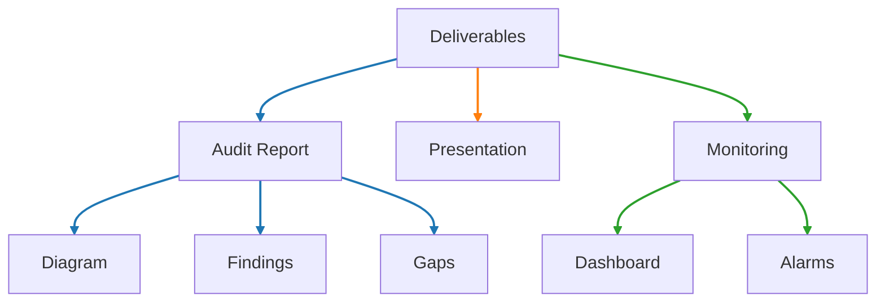

# Our Deliverables

Each audit engagement results in:

### 📄 Pipeline Audit Report

- Executive Summary
- Visual Pipeline Diagram
- Findings (Critical → Low)
  - Criticals are brought up immediately upon discovery
- Mitigation & Monitoring Guidance
- Compliance Gap Highlights

### 🖥️ Stakeholder Presentation (optional)
For executive audiences (CISO, VP Eng, etc.)
Team managing Data Pipelines

### 🚨 Component Monitoring (add-on)
Pipeline component alerts that detect threshold drops, anomalies or new risks.

### 🤝 Follow-Up Support
Need help fixing the issues? We're available post-audit.

[Schedule Meeting](){: .btn .btn-primary .fs-5 .mb-4 .mb-md-0 .mr-2 }
